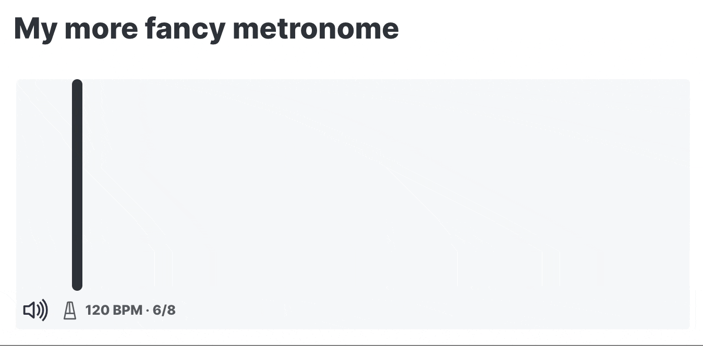
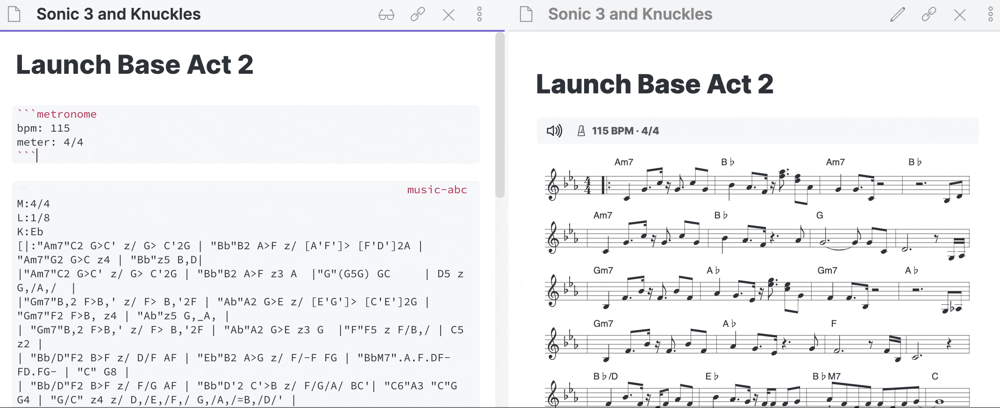
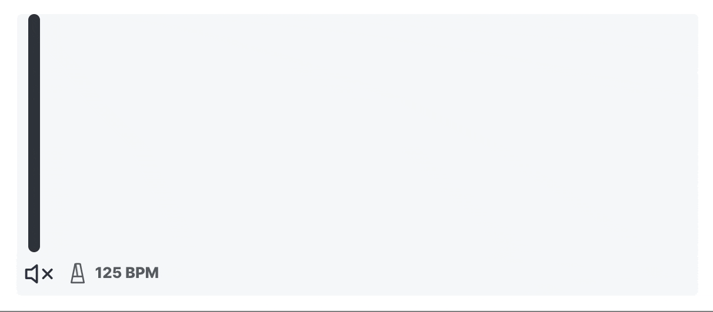

# Obsidian Metronome 🎵

Use this plugin to add interactive metronomes to your notes. Use just the visual metronome or turn on a click or beep. Customize the tempo, meter, instrument, size, and more. Pair it with [obsidian-plugin-abcjs](https://github.com/TilBlechschmidt/obsidian-plugin-abcjs) to have your score and metronome living in harmony in a single note!

This markdown in your Obsidian note:

````markdown
# My Metronome

```metronome
bpm: 120
meter: 3/4
size: medium
```
````

Produces this interactive metronome:


## Why?

I use [obsidian-plugin-abcjs](https://github.com/TilBlechschmidt/obsidian-plugin-abcjs) for writing out music notation in Obsidian and sometimes during live performances I have a need to know what tempo to play a song. This plugin provides a visual metronome that I can have right alongside my music that serves as a great reminder of the correct tempo for a live performance. During practice, I can unmute it and practice alongside it as it clicks on the beat.

## Install

1. In Obsidian, go to Settings > Community Plugins and disable safe mode if it is enabled.
1. Select **Browse** and search for the **Metronome** plugin.
1. Install the plugin.
1. Enable the plugin.

## Usage

Open a note and place a code block in your note like the one below. Give it a `bpm` ([beats per minute](https://en.wikipedia.org/wiki/Tempo)) for your tempo. In the example below, I've set `bpm` to `120`.

````markdown
# My basic metronome

```metronome
bpm: 120
```
````

This produces a visual metronome in your note. By default it is muted, but you can press the unmute button to hear it click (or change the `muted` option so it clicks by default &mdash; see below for more options).


You can customize the metronome further:

````markdown
# My more fancy metronome

```metronome
bpm: 120
meter: 12/8
size: large
instrument: beep
tickNotes: A5
tockNotes: A4
```
````



## Metronome Options

These are all the options you can change when creating a metronome. Only the `bpm` option is required.

| Option       | Type                                                                                                           | Description                                                                                                                                                                                                                                                                                                                                                                                  | Default              |
| ------------ | -------------------------------------------------------------------------------------------------------------- | -------------------------------------------------------------------------------------------------------------------------------------------------------------------------------------------------------------------------------------------------------------------------------------------------------------------------------------------------------------------------------------------- | -------------------- |
| `bpm`        | number                                                                                                         | Tempo in [beats per minute](https://en.wikipedia.org/wiki/Tempo). Must be greater than 0.                                                                                                                                                                                                                                                                                                    | (required)           |
| `meter`      | string                                                                                                         | The [time signature](https://en.wikipedia.org/wiki/Time_signature) (meter) to play in. The bottom number must be 1, 2, 4, 8, 16, 32, or 64. Examples: 4/4, 3/4, 6/8, 12/8.                                                                                                                                                                                                                   | `4/4`                |
| `muted`      | `yes` or `no`                                                                                                  | Whether or not the metronome's audio starts muted.                                                                                                                                                                                                                                                                                                                                           | `yes`                |
| `autoStart`  | `yes` or `no`                                                                                                  | Whether or not the metronome starts flashing visually right away. If `autoStart` is `yes` and `muted` is `no`, then the metronome's sound will also start playing immediately.                                                                                                                                                                                                               | `yes`                |
| `size`       | `small`, `medium`, `large`, or `xlarge`                                                                        | Control the size of the metronome in the note.                                                                                                                                                                                                                                                                                                                                               | `small`              |
| `style`      | `pulse`, `pendulum`, `line`                                                                                    | Control the style of the metronome. `pulse` makes the whole area flash color. `pendulum` shows an illustration of a metronome with a swinging pendulum (works best with `large` and up sizes). `line` shows a vertical line moving left and right (works best with `large` and up sizes).                                                                                                    | `pulse`              |
| `instrument` | `click`, `beep`, `AMSynth`, `DuoSynth`, `FMSynth`, `MembraneSynth`, `MetalSynth`, `MonoSynth`, or `PluckSynth` | Change the metronome's instrument.                                                                                                                                                                                                                                                                                                                                                           | `click`              |
| `tickNotes`  | string                                                                                                         | This determines the note(s) played on the **downbeat**, specified in [scientific pitch notation](https://en.wikipedia.org/wiki/Scientific_pitch_notation). (For example, middle C is C4.) Multiple tones can be played at the same time by providing a comma-separated list of tones. If there is no meter, every beat is considered a downbeat. Has no effect when `instrument` is `click`. | `C6`<br/>`F5,A5,C5`  |
| `tockNotes`  | string                                                                                                         | This determines the note(s) played on the **upbeat**, specified in [scientific pitch notation](https://en.wikipedia.org/wiki/Scientific_pitch_notation). (For example, middle C is C4.) Multiple tones can be played at the same time by providing a comma-separated list of tones. If there is no meter, every beat is considered a downbeat. Has no effect when `instrument` is `click`.   | `C5`<br/>`F4,A4,C4 ` |

## Examples

### Setting `autoStart: no` on a metronome

If a metronome has `autoStart: no`, it won't start flashing when you open the note. You can also edit metronomes inline using Obsidian's live preview feature.


### Include alongside music notation

The metronome works great when placed alongside music notation using the [obsidian-plugin-abcjs](https://github.com/TilBlechschmidt/obsidian-plugin-abcjs) plugin.



### Play multiple tones at once

Set `tickNotes` and `tockNotes` to a comma-separated list of tones to play those tones all at once in a chord.

````markdown
```metronome
bpm: 80
meter: 4/4
instrument:beep
tickNotes: F4,A4,C4
tockNotes: D4,F4,A4
```
````

### Using different instruments and tones

````markdown
```metronome
bpm: 90
meter: 4/4
instrument: AMSynth
tickNotes: C5,E5
tockNotes: D5,F5
```
````

````markdown
```metronome
bpm: 90
meter: 4/4
instrument: DuoSynth
muted: no
tickNotes: A3
tockNotes: B3
```
````

````markdown
```metronome
bpm: 90
meter: 4/4
instrument: FMSynth
tickNotes: A4
tockNotes: C#5,E5
```
````

````markdown
```metronome
bpm: 90
meter: 4/4
instrument: MembraneSynth
tickNotes: B6
tockNotes: B5
```
````

````markdown
```metronome
bpm: 90
meter: 4/4
instrument: MetalSynth
tickNotes: G3
tockNotes: D0
```
````

````markdown
```metronome
bpm: 90
meter: 4/4
instrument: MonoSynth
tickNotes: C5,E5,G5
tockNotes: F5,A6,C6
```
````

````markdown
```metronome
bpm: 90
meter: 4/4
instrument: PluckSynth
tickNotes: A4
tockNotes: E4
```
````

### `pulse` style (default)

````markdown
```metronome
bpm: 125
size: large
style: pulse
```
````


### `pendulum` style

Works best on `large` and `xlarge` sizes.

````markdown
```metronome
bpm: 125
size: large
style: pendulum
```
````


### `line` style

Works best on `large` and `xlarge` sizes.

````markdown
```metronome
bpm: 125
size: large
style: line
```
````



### Works with themes

The metronome works great with Obsidian's themes in light or dark mode.

Theme: Obsidian Default (Dark)


Theme: Minimal (Light)


Theme: [Obsidian Atom](https://github.com/kognise/obsidian-atom) (Dark)


